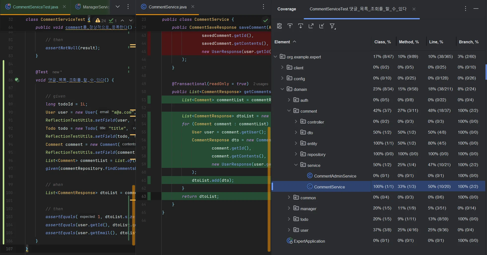

# SPRING ADVANCED

## Lv.1-1 코드 개선 - Early Return (회원가입 로직 변경)

>**해결 과정** : https://dandy-tiger-0ef.notion.site/Lv-1-1-Early-Return-1a4970eb707b80d3be6ad0944e442c7c
>
>**파일 위치**
>
> `package org.example.expert.domain.auth.service.AuthService`
1. 애초에 이메일이 중복된다면 회원가입이 진행되지 않음.
2. 이메일 중복 체크 코드가 우선 실행되도록 로직 최상단에 위치.

## Lv.1-2 리팩토링 - 불필요한 if-else 피하기 (날씨정보 호출 서비스 로직 개선)
>**해결 과정** : https://dandy-tiger-0ef.notion.site/Lv-1-2-if-else-1a4970eb707b8069a467eeb3731ce816
>
>**파일 위치**
> 
> `package org.example.expert.client.WeatherClient`
1. 절차적 코드 실행에서, 첫번째 if 문이 실행되면 그 이후 코드는 실행되지 않음.
2. 기존의 로직에서 만약 첫번째 if 문을 통과했다면, 두번째 if문은 실행되지 않음.
3. 하지만 responseEntity 객체의 상태코드가 OK가 아니라면, weatherArray 또한 의미가 없어짐. 또는 responseEntity 객체에 상태코드가 OK여도 데이터가 없는 경우가 발생 할 수 있음.
4. 따라서, 두 조건문을 분리하여도 순서만 올바르다면 3번의 조건을 체크할 수 있음.
5. 4번을 이행하기 위해 기존 if-else 문을 2개의 if문으로 순서에 맞게 분리.

## Lv.1-3 코드 개선 - Validation (서비스 로직의 책임 개선)
>**해결 과정** : https://dandy-tiger-0ef.notion.site/Lv-1-3-Validation-1a4970eb707b806c9376c82e915903b7?pvs=74
>
>**파일 위치**
> 
> `package org.example.expert.domain.user.service.UserService`
> 
> `package org.example.expert.domain.user.dto.request.UserChangePasswordRequest`
> 
> `package org.example.expert.domain.user.controller.UserController`
> 
> `package org.example.expert.config.GlobalExceptionHandler`
1. 불필요한 검증이 비즈니스 로직에 혼재되어 있음.
2. RequestDto에서 @Valid 어노테이션을 활용하여, 비즈니스 로직의 불필요한 코드를 줄일 수 있음.
3. @Valid 가 적용될 수 있도록, 컨트롤러의 매개변수에 어노테이션 추가
4. @ControllerAdvice 에서 처리할 수 있도록 @Valid 관련 핸들러 매서드 추가.

## Lv.2 N+1 문제 (리포지토리 가독성, 유지보수성 개선)
>**해결 과정** : https://dandy-tiger-0ef.notion.site/Lv-2-N-1-1a4970eb707b8029bd7ef3a163e16b75
> 
> **파일 위치**
> 
> `package org.example.expert.domain.todo.repository.TodoRepository`
>
> `package org.example.expert.domain.todo.service.TodoService`
1. 스프링 프레임워크 에서 제공하는 @EntityGraph 를 사용하여 자바의 언어로만 쿼리관계를 작성.
2. JPQL에서 제공하는 SQL과 유사한 문법이 눈에 보이지 않으므로, 가독성과 유지 보수성 향상.

## Lv.3-1 테스트 코드 연습 (테스트가 목적에 맞게 실행되도록 코드 수정)
>**해결 과정** : https://dandy-tiger-0ef.notion.site/Lv-3-1-1a4970eb707b8075bad7f207bc3ed2c2?pvs=74
> 
> **파일 위치**
> 
> `package org.example.expert.config.PasswordEncoderTest`
1. 테스트 코드 중 when 은 PasswordEncoder의 matches 매서드가 매개변수에 따라 동작했을때 boolean 상태값을 리턴함.
2. then 은 해당 상태값을 판별.
3. matches 매서드에 들어가는 매개변수의 순서가 틀림. (즉 상태값 false를 반환할 것으로 예상)
4. 상태값을 올바르게 체크하도록 then 의 assertTrue 매서드를 assertFalse로 바꿈.
- 시크릿 키 코드가 있는 설정파일(application.yml)이 git 에 업로드 되지 않도록 gitignore 설정 추가

## Lv.3-2 테스트 코드 연습 (3문제)
>**해결 과정** : https://dandy-tiger-0ef.notion.site/Lv-3-2-1a5970eb707b8091ba98ed1eb08a0920
> 
> **파일 위치**
> 
>`package org.example.expert.domain.manager.service.ManagerServiceTest`
>
>`package org.example.expert.domain.manager.service.CommentServiceTest`
> 
>`package org.example.expert.domain.manager.service.ManagerServcice`
### [ Lv.3-2-1 ]
1. 매서드명을 IRE를 던지는 것으로 수정.
2. 테스트 목적에 맞게, 예외 메시지가 동일한지 확인하는 테스트코드 삭제.
3. 상태값도 필요 없으므로 삭제.

### [ Lv.3-2-2 ]
1. 매서드명을 IRE를 던지는 것으로 수정.
2. 테스트코드의 예외를 실제 코드에서 발생하는 예외와 일치시킴.

### [ Lv.3-2-3 ]
1. 서비스 로직에 todo의 user 필드 null 체크 코드 추가.
2. 그에 맞는 동일한 예외메시지를 테스트코드에 작성.

## Lv.4 로깅 구현 (AOP)
>**해결 과정** : https://dandy-tiger-0ef.notion.site/Lv-4-AOP-1a5970eb707b80f6a8a1e80f9c459d43?pvs=74
> 
> **파일 위치**
> 
>`package org.example.expert.config.BodyCachingFilter`
> 
>`package org.example.expert.config.CachedBodyHttpServletRequest`
> 
>`package org.example.expert.config.FilterConfig`
> 
>`package org.example.expert.config.LoggingAspect`
1. 기존 jwtFilter에서 이미 인증/인가를 진행 하였으므로, Aop에서는 어드민 권한 요청에 대해서만 로깅 작성.
2. 로깅에 요청바디/응답바디가 사용됨. 하지만 요청/응답 바디를 한번 읽으면 다시는 읽을 수 없게 되버려, 로깅 이후의 요청이나 응답값이 다음 단계에 도달하지 못함.
3. 이에 대한 방안으로 필터에서 요청/응답 값을 캐싱 처리하여 재사용하는 방식을 선택.
4. CachedBodyHttpServletRequest 에서는 요청바디를 캐싱하여 값을 저장하는 기능을 함.
5. BodyCachingFilter 에서는 위 캐싱 클래스를 사용하여 요청/응답바디 캐싱
6. 생성한 필터를 FilterConfig 에 등록
7. LoggingAspect 에서 로깅처리

## Lv.5 임의로 정의한 문제 해결 (가독성 개선)
>**해결 과정** : https://dandy-tiger-0ef.notion.site/Lv-5-1a5970eb707b80dea502fc1875810c01?pvs=74
> 
> **파일 위치**
> 
> `package org.example.expert.domain.comment.repository.CommentRepository`
>
> `package org.example.expert.domain.todo.repository.TodoRepository`
>
> `package org.example.expert.domain.Manager.repository.ManagerRepository`
1. 사용하지 않는 메서드 제거
2. @query 를 @EntityGraph 로 변경
3. 매서드 명을 명확하게 변경

## Lv.4 수정 - 스프링 제공기능인 ContentCachingRequestWrapper 사용
>**해결 과정** : https://dandy-tiger-0ef.notion.site/Lv-4-ContentCachingRequestWrapper-1a7970eb707b80eaa524f95077eb34bd?pvs=74
> 
> **파일 위치**
> 
> `package org.example.expert.config.BodyCachingFilter`
>
> `package org.example.expert.config.LoggingAspect`
1. 기존에는 package org.example.expert.config.CachedBodyHttpServletRequest라는 별도의 커스텀 클래스에서 요청바디를 캐싱처리하고 있었음. 
2. 기존 요청바디의 캐싱을 진행하던 클래스를 삭제하고, ContentCachingRequestWrapper를 사용하여 AOP 수정.

## Lv.6 테스트 커버리지 (테스트 코드 작성 및 확인)
>**해결 과정** : https://dandy-tiger-0ef.notion.site/Lv-6-README-md-1a6970eb707b804399afc00b833a64b4?pvs=74
> 
> **파일 위치**
> 
> `package org.example.expert.domain.comment.service.CommentServiceTest`
1. 댓글 서비스의 댓글목록조회 매서드를 선택.
2. 테스트 코드 작성 및 진행.
3. 원본코드의 커버 범위 및 테스트 커버리지 확인.
### 테스트 커버리지 확인

